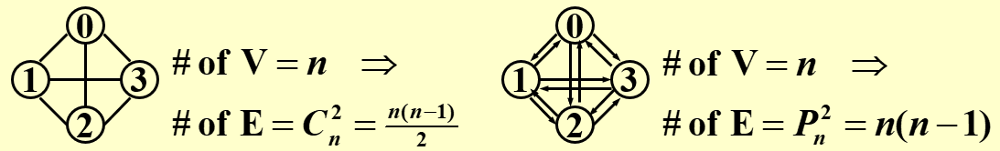
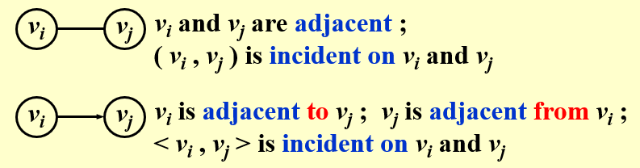
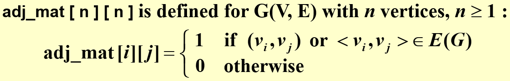
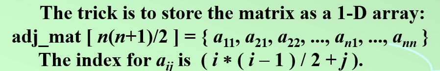

# WEEK 8

## 6 Graph Algorithms

### 6.1 Definitions

- $G( V, E )$ where $G$ = graph, $V = V( G )$ = finite nonempty set of vertices, and $E = E( G )$ = finite set of edges.

#### Undirected graph 

- $( v_i , v_j ) = ( v_j , v_i )$ = the same edge.

#### Directed graph(diagraph)

#### Restrictions

- **Self loop** is illegal.
- **Multigraph** is not considered.

#### Complete graph

- A graph that has the maximum number of edges.

#### Adjacent

#### Subgraph

$$
G'\subset G=V(G')\subseteq V(G) \&\& E(G')\subseteq E(G)
$$

#### Path

- Path($\subset G$) from $v_p$ to $v_q$ = $\{v_p,v_{i1},v_{i2},\cdots,v_{in},v_q\}$ such that $(v_p,v_{i1}),(v_{i1},v_{i2}),\cdots,(v_{in},v_q)$ belong to $E(G)$

#### Length of a path

- number of edges on the path

#### Simple path

- $v_{i1},v_{i2},\cdots,v_{in}$ are distinct.

#### Cycle

- simple path with $v_p=v_q$

#### Connected

- $v_i$ and $v_j$ in an undirected $G$ are connected if there is a path from $v_i$ to $v_j$ (and hence there is also a path from $v_j$ to $v_i$)
- An undirected graph $G$ is connected if every pair of distinct $v_i$ and $v_j$ are connected

#### (Connected) Component of an undirected G

- the maximal connected subgraph

#### Tree

- a graph that is connected and acyclic(非循环的)

#### DAG

- a directed acyclic graph

#### Strongly connected directed graph G

- for every pair of $v_i$ and $v_j$ in $V( G )$, there exist directed paths from $v_i$ to $v_j$ and from $v_j$ to $v_i$.  
- If the graph is connected without direction to the edges, then it is said to be weakly connected

#### Strongly connected component

- the maximal subgraph that is strongly connected

#### Degree

- number of edges incident to v

- For a directed G, we have **in-degree** and **out-degree**.

- Given G with $n$ vertices and $e$ edges, then
  $$
  e=(\sum_{i=0}^{n-1}d_i)/2\quad where\quad d_i=degree(v_i)
  $$
  
- 

### 6.2 Representation of Graphs

#### Adjacent Matrix

- Note : If G is undirected, then adj_mat[]\[] is symmetric. Thus we can save space by storing only half of the matrix.
- This representation wastes space if the graph has a lot of vertices but very few edges.

- To find out whether or not $G$ is connected, we’ll have to examine all edges. In this case $T$ and $S$ are both $O( n^2 )$.

#### Adjacency Lists

- Replace each row by a linked list
- Note : The order of nodes in each list does not matter.
- For undirected $G$, $S$ = $n$ heads + $2e$ nodes  = $(n+2e)$ ptrs + $2e$ ints
- Degree(i) = number of nodes in graph[i]\(if $G$ is undirected)
- $T$ of examine $E(G)$ = $O(n+e)$

#### Adjacency Multilists

#### Weighted Edges

### 6.3 Topological Sort

#### AOV Network

#### Partial order

#### [Definition] A *topological order* is a linear ordering  

